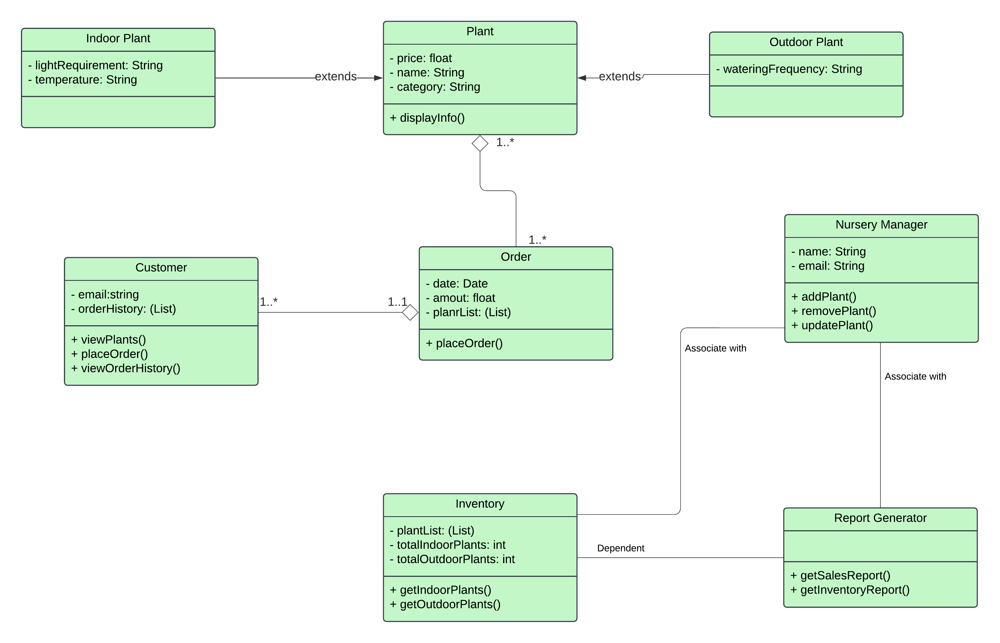

# **Project : Nursery Management System**
In the following documentation I have added my approach to complete this project
## 1.Understanding the Problem
### What the system supposed to do?
- customer can buy plants   
- Nursery Manager can manage plants
- maintain an inventory of plants
- Generate monthly sales and inventory reports

### Main Actors
- **Customer:** Interacts with nursery to browse and purchase plants
- **Manager:** Manages plant data, inventory, and generates reports
- **Plant:** Represents the entity sold by the nursery

### Operations
- customer can getPlantList, buy a plant
- manager can add, remove or update a plant data
- monthly reports can be generated

## 2.Identification of classes and objects
**Classes:** Plant (base class for indoor or outdoor plants), Customer, Manager, Order, Inventory, Report Generator

## 3.Finding Relationships
**Inheritance (Is-a)**
Plant -> IndoorPlant, OutdoorPlant
**Association (Has-a)**
- Manager -> Inventory, ReportGenerator
**Dependency (Uses)**
- Customer uses Plant and Order
- Manager interacts with Plant, ReportGenerator, Inventory

## 4.Defining properties and methods
#### Plant
**properties:** name (String), price (float), category (String)
**methods:** displayInfo(): Display plant details.

#### Customer 
**properties:** email (String), orderHistory (List<Order>)
**methods:** viewPlants(): View available plants.
placeOrder(): Purchase plants.
viewOrderHistory(): View past orders.

#### Order 
**properties:** date (Date), amount (float), customerId (String), plantList (List<Plant>)
**methods:** placeOrder(): Save and process an order.

#### NurseryManager 
**properties:** name (String), email (String)
**methods:** addPlant(): Add a new plant to inventory.
removePlant(): Remove a plant from inventory.
updatePlant(): Update details of a plant.

#### Inventory
**properties:** plantList (List<Plant>), totalOutdoorPlants (int), totalIndoorPlants (int)
**methods:** getIndoorPlants(): Retrieve indoor plants from inventory.
getOutdoorPlants(): Retrieve outdoor plants from inventory.

#### ReportGenerator
**methods:** generateSalesReport(): Generate a report of total sales.
generateInventoryReport(): Generate a report of inventory status.

#### IndoorPlant
**properties:** lightRequirement (String), temperature (String)
**methods:** displayInfo(): Display plant details.

#### OutdoorPlant
**properties:** wateringFrequency (String) 
**methods:** displayInfo(): Display plant details.

## 5.Applying Design Principles

## Class Diagram 

## Sequence Diagrams
### Diagram 1 - Customer interaction

### Diagram 2 - Nursery Manager interaction
